# Quick Start for Deloitte Engineering AI Day 2025

## 🚀 Quick Start
# Provisioning of the AWS Machine

1) Click Below link to go to AWS Workshop Studio

 [AWS Workshop Studio](https://catalog.us-east-1.prod.workshops.aws/join)


2) Click on **Get Started**


3) Click Email one-time password (OTP)

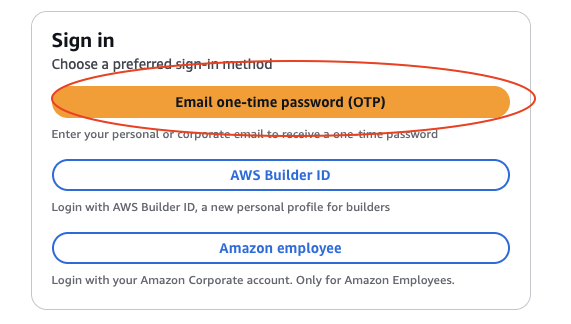

4) Enter your email address and click **Send** passcode
5) You will receive an email from AWS with a 9-digit OTP in it ( If you don't receive it please check your Spam/Junk Folder)
	Paste/Enter that 9-digit OTP to the AWS Workshop Studio
6) Enter your event access code and click **Next**.
    **This code will be provided by the facilitators.**
    
    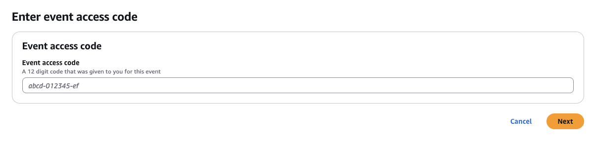

7) Review the "terms and conditions", click **I agree with the Terms and Conditions** and click **Join event** 

    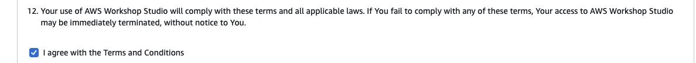

8) Ciick **Get AWS CLI Credentials** button.

	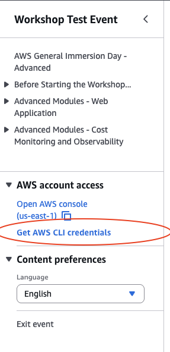

9) Copy and paste the export information to a notepad/notebook.
	**This information will be needed during the provisioning of the machines**

	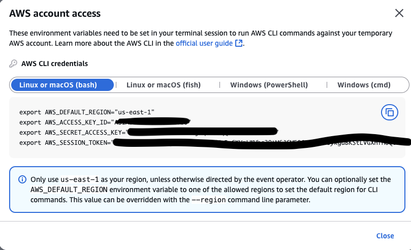

10) Close **AWS account access** popup and click **Open AWS Console (us-east-1)** on the left menu.

11) On AWS Console, Search for **EC2** and Press Enter

12) In **EC2** menu, under **Network & Security**, click **Key Pairs**

	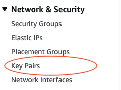

13) Click **Create key Pair** in the upper right corner. In the Create key pair screen, enter a name for the key pair.
    
	 **Note:  This key pair name is important for future steps.** 
     
    Leave the rest as default and click **Create key Pair**. 
    
    **When this step successfully completes, it will download a pem file to your machine.** 

    **This PEM file will be used to login to the EC2 instance for the workshops so make sure where you download it.**

	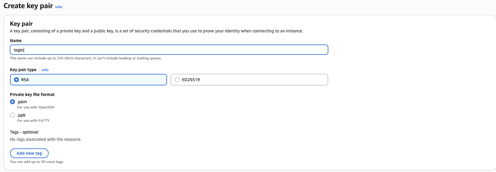

14) Download **CloudFormation** Yaml File and save it to your laptop : [Download](/cloudformation-ec2.yaml)
15) On AWS Console, Search for **CloudFormation** and select CloudFormation service.
16) Click **Create Stack**
17) From **Prerequisite - Prepare template** screen, 
- Select **Choose an existing template** 
- From **Specify Template** select **Upload a template file**.
- Click **Choose file** and select the CloudFormation Yaml file that you downloaded in the previous steps
- Click **Next**

	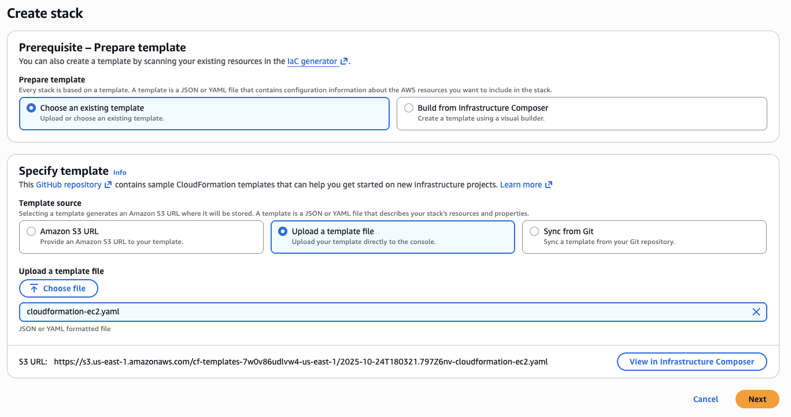

18) In **Specify Stack** details, 
- Enter a **stack name**
- Enter your keypair name that you created in previous steps in the **KeyPairName** field. 
- Leave the rest default 
- Click **Next**

    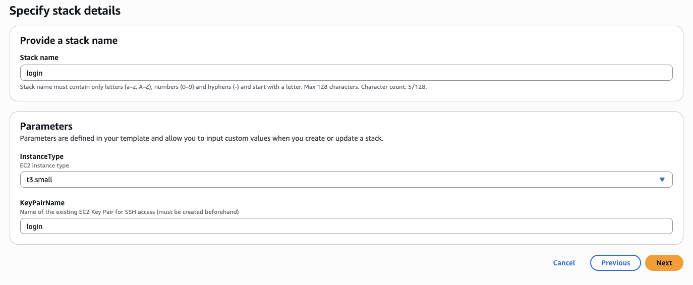


19) Leave the rest of the options as default click **Next** and then click **Submit** the template to start CloudFormation.
20) CloudFormation script may take couple of minutes to complete. You can click the Refresh: Events button to check the status. When the stack is complete, the stacks status on the left side will be show the message of **CREATE_COMPLETE**

	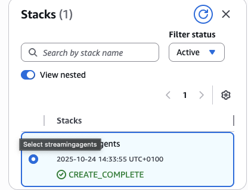

21) When stack is complete, click **Outputs** and note down **PublicDNS** value. 
	This is the hostname of the machine you will use to run the commands

	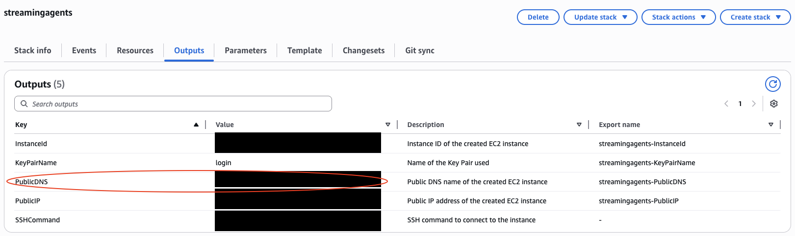

**With these steps you provisioned the machine to install the necessary tools**

22) Open a terminal (powershell in windows) and go to the folder where you downloaded the PEM file in step 14 and run below command. Don't forget to replace **\<name of the pem file\>** with the name of your **keypair** file name and **\<PublicDNS\>** with **PublicDNS** value from previous step
	```bash
	ssh -i ./<name of the pem file>.pem ubuntu@<PublicDNS>
	```

**Note:**  If you receive an error saying **"Unprotected Private Key File"** run below commands and rerun the above command. 

For MacOS:

```bash
chmod 400 <name of the pem file>.pem
```

For Windows:

```bash
icacls .\<name of the pem file>.pem /inheritance:r
icacls .\<name of the pem file>.pem /grant:r "%username":"(R)"
```

23) Clone the repo

```bash
git clone https://github.com/korzan-og/deaid-quickstart.git
```

24) Change directory to the folder and run below command to make the script runnable. 

```bash
cd deaid-quickstart
chmod +x install-dependencies.sh
```
Run below command to install the dependencies. The last command will install all dependencies with one script.
**It may take couple of minutes for script to complete**

```bash
./install-dependencies.sh
```

25) For some changes to take effect, disconnect from machine and reconnect by running the ssh command

```bash
exit
```

```bash
ssh -i ./<name of the pem file>.pem ubuntu@<PublicDNS>
```

26) Proceed to the first exercise! **Good luck**
